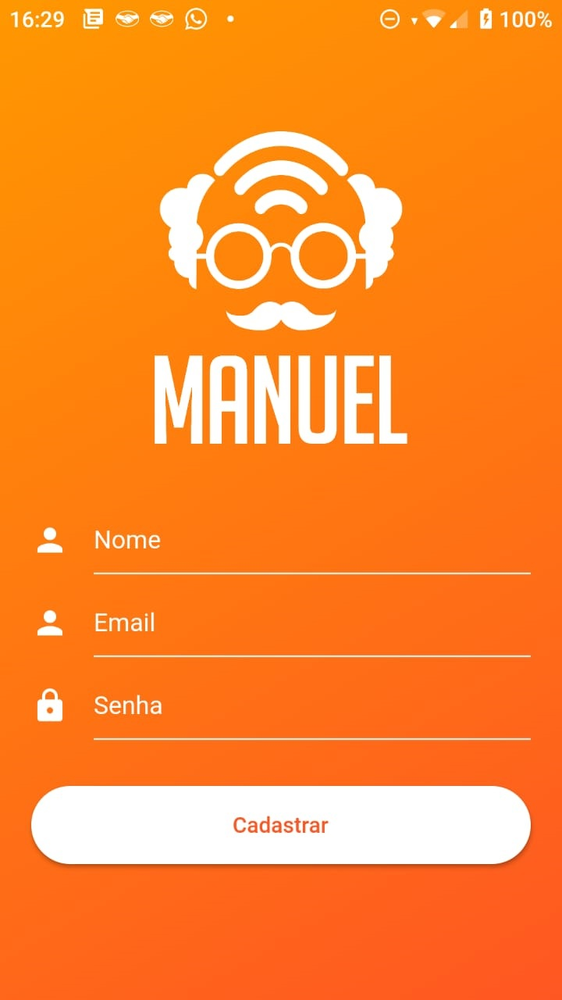

# Initial page

## Hackaton Manuel 2019 - Projeto Cloud

[](https://nodesource.com/products/nsolid)

[](https://travis-ci.org/joemccann/dillinger)

## About 

### Meet our App in Flutter!




## 2\) Usamos o Arduino + Wifi para nossa solução

## 3\) Vendo nossos sensores alimentando as mensagens no MQTT

## 4\) Fazendo as API's de TTS e STT responderem as requisições

## 5\) Utilizamos API conversacional na aplicação ALTU

## 5\) Utilizando o Python no server com auxílio da MathPI:

Dentro da pasta "my\_flash\_app", basta rodar os seguintes comandos:

Por padrão será exposta a porta 5000, do endereço local, onde consumiremos a instância AWS:

```bash
export FLASK_APP=extract_DB
flask run
```

OBS: Na pasta my\_flash\_app/ basta executar os seguintes comandos antes de rodar flusk:

```bash
python3 -m venv venv
source venv/bin/activate
```

Verifique no browser para atestar o resultado das queries feitas no MySQL:

```bash
127.0.0.1:5000
```

### Equipe:

* Pedro Etelvino
* Guilherme S. Borges
* Brian Mendes
* Mateus
* Milena

**Free Software, Hell Yeah! IOT on the open-source world !!!!!**

